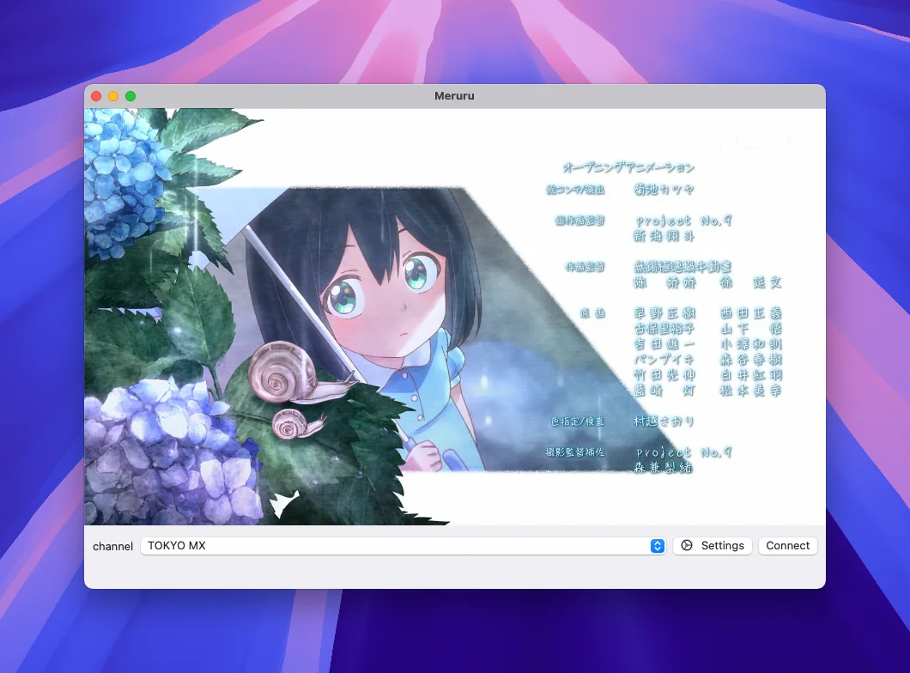

# Meruru

A Simple [Mirakurun](https://github.com/Chinachu/Mirakurun)/[mirakc](https://github.com/mirakc/mirakc) Client for macOS.



## Requirements

- macOS v14+ (Sonoma)

## Build

You can build Meruru using [Swift Bundler](https://swiftbundler.dev/) in macOS environment.

```shell
make build
open Meruru.app
```

## License

[Apache License, Version 2.0](LICENSE)
